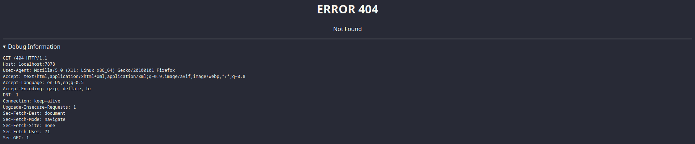

# ErrorServer
[](screenshot.png)
:rocket: A simple & lightweight server that returns a HTML page of the error code with its respective message and debug information, written in rust :crab:

## Features
- automatic resolving of error codes to their respective messages
  - if the error code is not found, it will print a generic error message
- simple, but not eye bleeding design
  - dark mode per default
  - colors follow the dracula theme specification
- display debug information
  - the request headers are printed in the debug section
  - hidden behind a dropdown to prevent accidentally leaking sensitive information
- perfect for traefik (examples coming soon!)
- written in rust :crab: :rocket:
- blazingly fast
  - over 700k requests per second on my machine (i7-9700k) 
- low memory footprint
  - ~ 3.5 MB while idling, benchmarks will follow
- small binary size
  - ~ 650 KB
- low-dependency
  - only hyper and tokio are used to provide a fast & solid base 
- easy to use
  - just run the binary and you're good to go
- customizable
  - the HTML file served can be replaced with your own
- docker support
  - built & published for AMD64 and ARM64

## Usage
### Docker
```bash
# caution: pin the tag for production use! Semver is supported.
docker run -p 7878:7878 ghcr.io/SIMULATAN/errorserver:latest
```

### Binary
```bash
# download the latest release from the releases page
# or build it yourself
# caution: the "error.html" file must be in the same directory as the binary
./error_server
```

## Contributions
... are welcome! If you have any ideas, feel free to open an issue or a pull request. I'd also appreciate feedback on the code, as I'm still learning rust (this is literally my first project using it :sweat_smile:).
